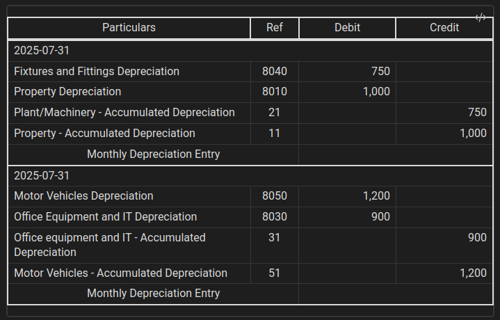
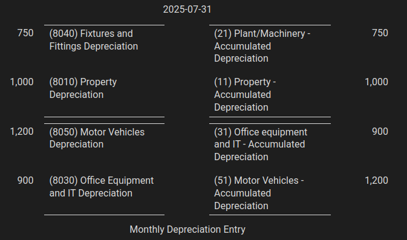
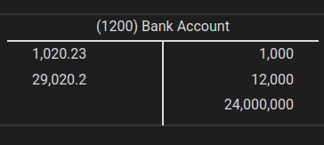

# Accounting Journal and Ledger

A lightweight Obsidian plugin for recording simple journal entries in class, based on the Spanish _libro diario_ and _libro mayor_. Uses double-entry bookkeeping. Designed for educational use or for creating example entries easily — not a full accounting system.

## Features

- Register journal entries using standard format and classical Spanish format (*libro diario*)
- Minimal interface focused on simplicity and clarity
- Entries saved as Markdown for transparency and customization
- Manual or file-based account recognition — you can provide your own chart of accounts
- Convert journal or ledger to clean HTML directly from within the active Obsidian note

## Usage

### Journal and Ledger Entries

This plugin recognizes accounting entries written inside Markdown code blocks using **custom tags**. Each tag corresponds to a different entry format. 

| Tag      | Format                       | Description                                                  |
|----------|------------------------------|--------------------------------------------------------------|
| `acj-m`  | Journal (Modern)             | One line per movement, concise and structured                |
| `acj`    | Journal (Traditional Spanish)| Classic format used in Spanish accounting education          |
| `acl`    | Ledger (T-Account Style)     | Visual layout of debit and credit similar to T-accounts      |


---

#### Format 1 & 2: Modern Journal (`acj-m`) and Traditional Spanish Journal (`acj`)

<pre>
```acj-m
{date},{concept}
{debit account} - {amount}
...
---
{credit account} - {amount}
...
===
{debit account} - {amount}
...
---
{credit account} - {amount}
...
```</pre>
- **First line**: `date,concept` — the date of the transaction and a short description.
- **Sections**:
  - Each section contains a **debit group** (above `---`) and a **credit group** (below `---`).
  - You can add multiple sections using `===`, useful for breaking the entry into phases or subcomponents.
- The date and concept apply to the **entire block**, not just the first section

##### Example
<pre>
```acj-m
2025-07-31,Monthly Depreciation Entry

8040 - 750  
8010 - 1000 
---
21 - 750
11 - 1000  
===
8050 - 1200  
8030 - 900
---
31 - 900
51 - 1200
```</pre>


<p align="center">
  
  
</p>

#### Format 3: Ledger
<pre>
```acl
{account}
{debit-amount}
{debit-amount}
...
---
{credit-amount}
{credit-amount}
...
```</pre>

##### Example

<pre>
```acl
1200
1020.23
29020.20
---
1000
12000
24000000
```
</pre>

<p align="center">
  
  <br><b>Ledger (T-Account Style)</b>
</p>

### Fix accounting entries

The `Fix accounting entries` command transforms your accounting blocks (`acj`, `acj-m`, `acl`) into **static HTML previews** directly inside the note. This makes the entry visually clear and presentation-ready — but no longer editable from within the block.

### Custom Chart of Accounts (CSV)

You can use your own chart of accounts by selecting a CSV file from the plugin settings.
#### CSV format

```csv
8010,Property Depreciation
11,Property - Accumulated Depreciation
1200,Bank
1210,Cash
```
The plugin will use it to display account names in fixed entries and exports. Remember that you must type the exact same code.

---

## Developer Setup

If you want to contribute or test the plugin locally:

1. Clone this repository
2. Run `npm install` to install dependencies
3. Run `npm run dev` to build and watch for changes
4. In Obsidian, enable **Developer Mode** and load the plugin folder as a local plugin in `Vault/.obsidian/plugins/accounting-journal-ledger`

The source code is written in TypeScript and uses standard Obsidian plugin APIs.

---

## Issues & Feature Requests

Feel free to open an issue for:

- Bug reports
- Suggestions for small enhancements
- Clarifications on usage

You’re also welcome to request new features, **as long as they keep the plugin simple and focused on learning**.

> This plugin is not intended to:
> - Automatically generate ledgers from logic-heavy rules  
> - Replace full accounting systems  
> - Handle complex workflows like payroll engines or tax reporting


---

## License

This project is under MIT License see [LICENSE](LICENSE) for more information


---


## Author

Developed by [JavierRibaldelRio](https://github.com/JavierRibaldelRio)